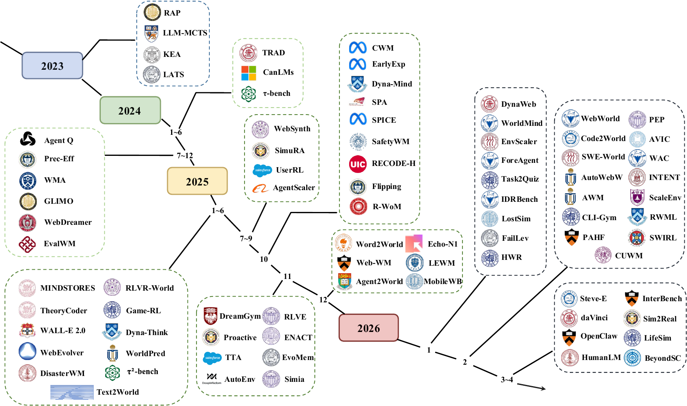
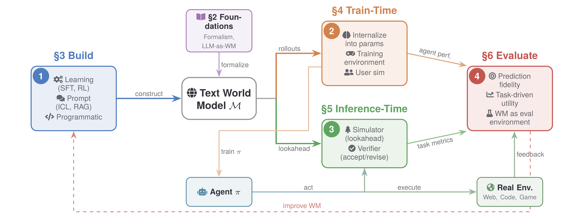
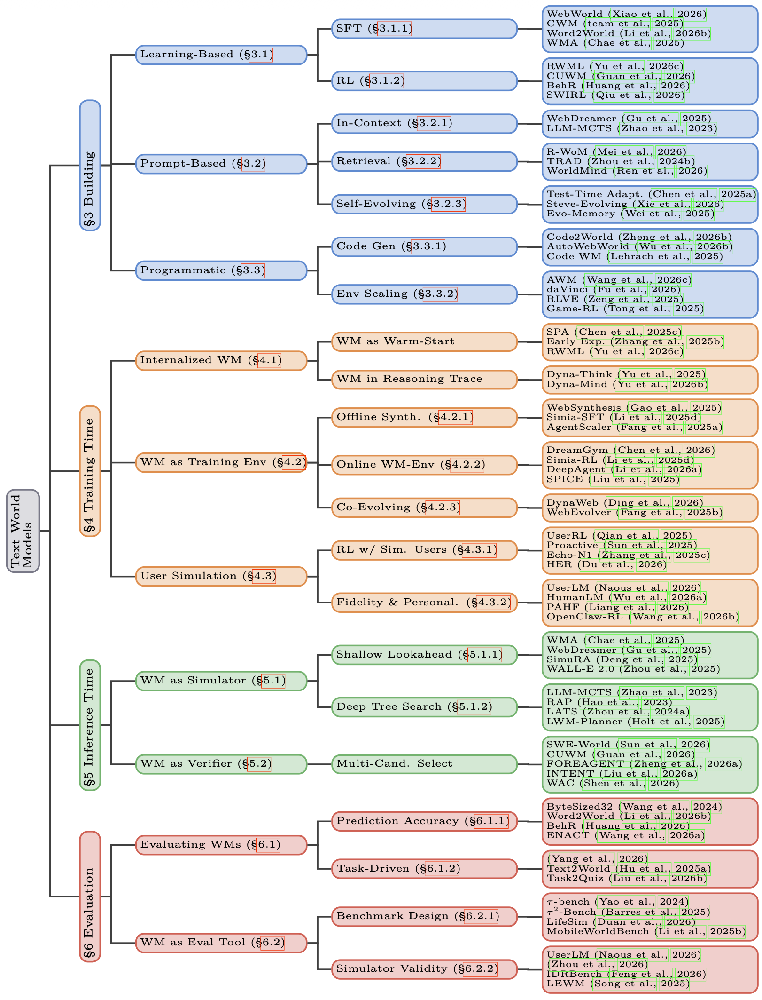
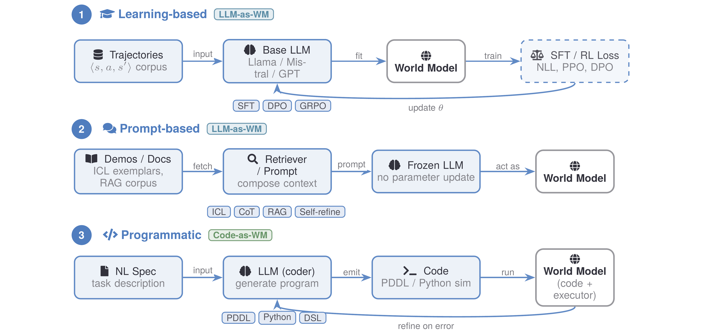
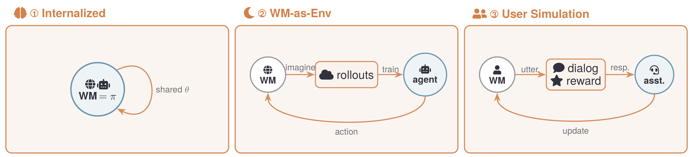
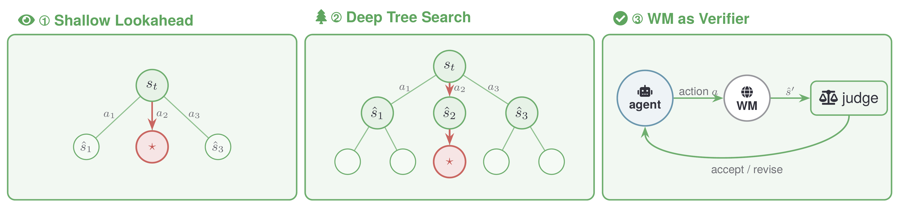
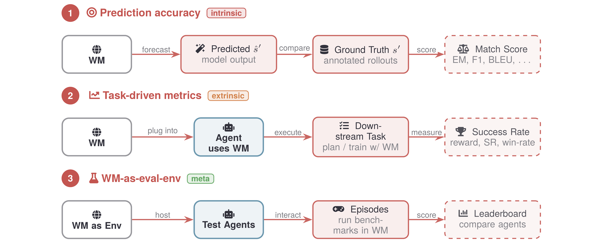

# Awesome Text World Models for LLM-based Agents

[](https://awesome.re)
[](https://opensource.org/licenses/MIT)
[](https://arxiv.org/abs/2606.09032)
[](https://github.com/pulls)

A curated list of papers on **Text World Models (TWMs)** for LLM-based agents — transition models over *textual* states that, given a state and a candidate action, predict the resulting webpage, terminal output, API response, or user reply, thereby supporting planning, efficient learning, and principled evaluation.

This list accompanies our survey ***[Bridging the Agent-World Gap: Text World Models for LLM-based Agents]()*** and is organized around the agent lifecycle: **Building → Training-Time → Inference-Time → Evaluation**.

<p align="center">
  
</p>

🤗 **Contributions are welcome!** If a paper or repository is missing, incorrect, or has been updated, please open an issue or pull request.

📫 **Contact us via emails:**  `liyixia@me.com`

📃**Please cite our paper** if you find our survey or repository helpful!

```bibtex
@misc{li2026textworldmodels,
      title={Bridging the Agent-World Gap: Text World Models for LLM-based Agents},
      author={Yixia Li and Hongru Wang and Peng Lai and Zhiwen Ruan and He Zhu and Youxin Zhu and Ganlong Zhao and Minda Hu and Yun Chen and Sibei Yang and Peng Li and Jeff Z. Pan and Jia Pan and Guanhua Chen and Yang Liu and Guanbin Li},
      year={2026},
      eprint={2606.09032},
      archivePrefix={arXiv},
      primaryClass={cs.CL},
      url={https://arxiv.org/abs/2606.09032},
}
```

---

## 📰 News

- **[2026/06]** 🎉 Our survey paper is now available on arXiv: [Bridging the Agent-World Gap: Text World Models for LLM-based Agents](https://arxiv.org/abs/2606.09032)!

---

## 🗺️ Overview

**The text world model lifecycle.** A world model $\mathcal{M}$ is first **constructed** via learning, prompting, or code generation; then used to **train** agents through synthetic rollouts and **guide** them via lookahead at inference time; and finally **evaluated** for fidelity and utility.

<p align="center">
  
</p>

---

## 📑 Table of Contents

- [🏗️ 3. Building Text World Models](#-3-building-text-world-models)
  - [3.1 Learning-Based Construction](#31-learning-based-construction)
  - [3.2 Prompt-Based Construction](#32-prompt-based-construction)
  - [3.3 Programmatic Construction (Code as World Model)](#33-programmatic-construction-code-as-world-model)
- [🎓 4. Training-Time World Models](#-4-training-time-world-models)
  - [4.1 Internalizing World Models into Agent Parameters](#41-internalizing-world-models-into-agent-parameters)
  - [4.2 World Models as Training Environments](#42-world-models-as-training-environments)
  - [4.3 User Simulation for Agent Training](#43-user-simulation-for-agent-training)
- [🔮 5. Inference-Time World Models](#-5-inference-time-world-models)
  - [5.1 World Model as Simulator: Shallow Lookahead](#51-world-model-as-simulator-shallow-lookahead)
  - [5.2 World Model as Simulator: Deep Tree Search](#52-world-model-as-simulator-deep-tree-search)
  - [5.3 World Model as Verifier](#53-world-model-as-verifier)
- [📊 6. Evaluation](#-6-evaluation)
  - [6.1 Evaluating World Models Themselves](#61-evaluating-world-models-themselves)
  - [6.2 Benchmark Design (WM as Evaluation Environment)](#62-benchmark-design-wm-as-evaluation-environment)
  - [6.3 Simulator Validity](#63-simulator-validity)


<p align="center">
  
</p>

---

## 🏗️ 3. Building Text World Models

How a text world model is constructed: by *learning* (fine-tuning an LLM into a WM), by *prompting* (eliciting dynamics from a frozen LLM), or by *programmatic synthesis* (generating executable code as the WM).

<p align="center">
  
</p>

### 3.1 Learning-Based Construction

Fine-tuning a base LLM into a world model via supervised learning on $\langle s, a, s' \rangle$ trajectories or reinforcement learning.

| Title | Year | Venue | Paper | Code |
|-------|------|-------|-------|------|
| **Making Large Language Models into World Models with Precondition and Effect Knowledge** | 2025 | COLING 2025 | [Paper](https://aclanthology.org/2025.coling-main.503/) | - |
| **From Word to World: Can Large Language Models be Implicit Text-based World Models?** | 2025 | arXiv | [Paper](https://arxiv.org/abs/2512.18832) | [Code](https://github.com/X1AOX1A/Word2World) |
| **CWM: An Open-Weights LLM for Research on Code Generation with World Models** | 2025 | arXiv | [Paper](https://arxiv.org/abs/2510.02387) | [Code](https://github.com/facebookresearch/cwm) |
| **Agent Learning via Early Experience** | 2025 | arXiv | [Paper](https://arxiv.org/abs/2510.08558) | - |
| **RLVR-World: Training World Models with Reinforcement Learning** | 2025 | arXiv | [Paper](https://arxiv.org/abs/2505.13934) | [Code](https://github.com/thuml/RLVR-World) |
| **WebWorld: A Large-Scale World Model for Web Agent Training** | 2026 | arXiv | [Paper](https://arxiv.org/abs/2602.14721) | - |
| **Reinforcement World Model Learning for LLM-based Agents** | 2026 | arXiv | [Paper](https://arxiv.org/abs/2602.05842) | - |
| **Self-Improving World Modelling with Latent Actions (SWIRL)** | 2026 | arXiv | [Paper](https://arxiv.org/abs/2602.06130) | [Code](https://github.com/yfqiu-nlp/swirl) |
| **Beyond State Consistency: Behavior Consistency in Text-Based World Models** | 2026 | arXiv | [Paper](https://arxiv.org/abs/2604.13824) | [Code](https://github.com/Ricardo-H/behr-wm) |
| **Computer-Using World Model** | 2026 | arXiv | [Paper](https://arxiv.org/abs/2602.17365) | - |

### 3.2 Prompt-Based Construction

Turning a frozen LLM into a world model through in-context exemplars, retrieval, or self-evolving memory — without parameter updates.

| Title | Year | Venue | Paper | Code |
|-------|------|-------|-------|------|
| **Large Language Models as Commonsense Knowledge for Large-Scale Task Planning (LLM-MCTS)** | 2023 | NeurIPS 2023 | [Paper](https://arxiv.org/abs/2305.14078) | [Code](https://github.com/1989Ryan/llm-mcts) |
| **TRAD: Enhancing LLM Agents with Step-Wise Thought Retrieval and Aligned Decision** | 2024 | SIGIR 2024 | [Paper](https://arxiv.org/abs/2403.06221) | [Code](https://github.com/skyriver-2000/TRAD-Official) |
| **Is Your LLM Secretly a World Model of the Internet? Model-Based Planning for Web Agents (WebDreamer)** | 2025 | TMLR | [Paper](https://arxiv.org/abs/2411.06559) | [Code](https://github.com/osu-nlp-group/webdreamer) |
| **Evo-Memory: Benchmarking LLM Agent Test-time Learning with Self-Evolving Memory** | 2025 | arXiv | [Paper](https://arxiv.org/abs/2511.20857) | - |
| **R-WoM: Retrieval-augmented World Model For Computer-use Agents** | 2026 | arXiv | [Paper](https://arxiv.org/abs/2510.11892) | - |
| **Aligning Agentic World Models via Knowledgeable Experience Learning (WorldMind)** | 2026 | arXiv | [Paper](https://arxiv.org/abs/2601.13247) | [Code](https://github.com/zjunlp/WorldMind) |
| **Steve-Evolving: Open-World Embodied Self-Evolution via Fine-Grained Diagnosis and Dual-Track Knowledge Distillation** | 2026 | arXiv | [Paper](https://arxiv.org/abs/2603.13131) | [Code](https://github.com/xzw-ustc/Steve-Evolving) |
| **Test-Time Adaptation for LLM Agents via Environment Interaction** | 2026 | ICLR 2026 | [Paper](https://arxiv.org/abs/2511.04847) | [Code](https://github.com/r2llab/GTTA) |

### 3.3 Programmatic Construction (Code as World Model)

Prompting an LLM to emit PDDL, Python, HTML, or DSL programs that an executor runs as the world model; and scaling up environment synthesis.

| Title | Year | Venue | Paper | Code |
|-------|------|-------|-------|------|
| **Code World Models for General Game Playing** | 2025 | arXiv | [Paper](https://arxiv.org/abs/2510.04542) | - |
| **Towards General Agentic Intelligence via Environment Scaling (AgentScaler)** | 2025 | arXiv | [Paper](https://arxiv.org/abs/2509.13311) | - |
| **Web World Models** | 2025 | arXiv | [Paper](https://arxiv.org/abs/2512.23676) | [Code](https://github.com/Princeton-AI2-Lab/Web-World-Models) |
| **Code2World: A GUI World Model via Renderable Code Generation** | 2026 | arXiv | [Paper](https://arxiv.org/abs/2602.09856) | [Code](https://github.com/AMAP-ML/Code2World) |
| **SWE-World: Building Software Engineering Agents in Docker-Free Environments** | 2026 | arXiv | [Paper](https://arxiv.org/abs/2602.03419) | [Code](https://github.com/RUCAIBox/SWE-World) |
| **AutoWebWorld: Synthesizing Infinite Verifiable Web Environments via Finite State Machines** | 2026 | arXiv | [Paper](https://arxiv.org/abs/2602.14296) | [Code](https://github.com/Evanwu1125/AutoWebWorld) |
| **CLI-Gym: Scalable CLI Task Generation via Agentic Environment Inversion** | 2026 | arXiv | [Paper](https://arxiv.org/abs/2602.10999) | [Code](https://github.com/LiberCoders/CLI-Gym) |
| **Agent World Model: Infinity Synthetic Environments for Agentic Reinforcement Learning** | 2026 | arXiv | [Paper](https://arxiv.org/abs/2602.10090) | [Code](https://github.com/Snowflake-Labs/agent-world-model) |
| **EnvScaler: Scaling Tool-Interactive Environments for LLM Agent via Programmatic Synthesis** | 2026 | arXiv | [Paper](https://arxiv.org/abs/2601.05808) | [Code](https://github.com/RUC-NLPIR/EnvScaler) |
| **ScaleEnv: Scaling Environment Synthesis from Scratch for Generalist Interactive Tool-Use Agent Training** | 2026 | arXiv | [Paper](https://arxiv.org/abs/2602.06820) | - |
| **daVinci-Env: Open SWE Environment Synthesis at Scale** | 2026 | arXiv | [Paper](https://arxiv.org/abs/2603.13023) | [Code](https://github.com/GAIR-NLP/OpenSWE) |

---

## 🎓 4. Training-Time World Models

How world models support agents at training time: by internalizing dynamics into agent parameters, by serving as training environments, or by simulating users.

<p align="center">
  
</p>

### 4.1 Internalizing World Models into Agent Parameters

Folding world-model predictions into the agent's own weights, as a warm-start or within the reasoning trace.

| Title | Year | Venue | Paper | Code |
|-------|------|-------|-------|------|
| **Internalizing World Models via Self-Play Finetuning for Agentic RL (SPA)** | 2025 | arXiv | [Paper](https://arxiv.org/abs/2510.15047) | [Code](https://github.com/shiqichen17/SPA) |
| **Agent Learning via Early Experience** | 2025 | arXiv | [Paper](https://arxiv.org/abs/2510.08558) | - |
| **Dyna-Think: Synergizing Reasoning, Acting, and World Model Simulation in AI Agents** | 2025 | arXiv | [Paper](https://arxiv.org/abs/2506.00320) | - |
| **Reinforcement World Model Learning for LLM-based Agents** | 2026 | arXiv | [Paper](https://arxiv.org/abs/2602.05842) | - |
| **Dyna-Mind: Learning to Simulate from Experience for Better AI Agents** | 2026 | ICLR 2026 | [Paper](https://arxiv.org/abs/2510.09577) | - |

### 4.2 World Models as Training Environments

Using a world model to synthesize trajectories offline, serve as an online RL environment, or co-evolve with the agent.

| Title | Year | Venue | Paper | Code |
|-------|------|-------|-------|------|
| **WebSynthesis: World-Model-Guided MCTS for Efficient WebUI-Trajectory Synthesis** | 2025 | arXiv | [Paper](https://arxiv.org/abs/2507.04370) | - |
| **Simulating Environments with Reasoning Models for Agent Training (Simia)** | 2025 | arXiv | [Paper](https://arxiv.org/abs/2511.01824) | - |
| **Towards General Agentic Intelligence via Environment Scaling (AgentScaler)** | 2025 | arXiv | [Paper](https://arxiv.org/abs/2509.13311) | - |
| **SPICE: Self-Play In Corpus Environments Improves Reasoning** | 2025 | arXiv | [Paper](https://arxiv.org/abs/2510.24684) | - |
| **WebEvolver: Enhancing Web Agent Self-Improvement with Co-evolving World Model** | 2025 | EMNLP 2025 | [Paper](https://arxiv.org/abs/2504.21024) | [Code](https://github.com/Tencent/SelfEvolvingAgent) |
| **Scaling Agent Learning via Experience Synthesis (DreamGym)** | 2026 | ICLR 2026 | [Paper](https://arxiv.org/abs/2511.03773) | - |
| **DeepAgent: A General Reasoning Agent with Scalable Toolsets** | 2026 | WWW 2026 | [Paper](https://arxiv.org/abs/2510.21618) | [Code](https://github.com/RUC-NLPIR/DeepAgent) |
| **DynaWeb: Model-Based Reinforcement Learning of Web Agents** | 2026 | arXiv | [Paper](https://arxiv.org/abs/2601.22149) | - |

### 4.3 User Simulation for Agent Training

Modeling the *human user* as a world model to train multi-turn, proactive, and personalized agents.

| Title | Year | Venue | Paper | Code |
|-------|------|-------|-------|------|
| **UserRL: Training Interactive User-Centric Agent via Reinforcement Learning** | 2025 | arXiv | [Paper](https://arxiv.org/abs/2509.19736) | [Code](https://github.com/SalesforceAIResearch/UserRL) |
| **Training Proactive and Personalized LLM Agents** | 2025 | arXiv | [Paper](https://arxiv.org/abs/2511.02208) | [Code](https://github.com/thunlp/ProactiveAgent) |
| **Echo-N1: Affective RL Frontier** | 2025 | arXiv | [Paper](https://arxiv.org/abs/2512.00344) | - |
| **HER: Human-like Reasoning and Reinforcement Learning for LLM Role-playing** | 2026 | arXiv | [Paper](https://arxiv.org/abs/2601.21459) | [Code](https://github.com/cydu24/HER) |
| **HumanLM: Simulating Users with State Alignment Beats Response Imitation** | 2026 | arXiv | [Paper](https://arxiv.org/abs/2603.03303) | - |
| **Flipping the Dialogue: Training and Evaluating User Language Models (UserLM)** | 2026 | ICLR 2026 | [Paper](https://arxiv.org/abs/2510.06552) | - |
| **Learning Personalized Agents from Human Feedback (PAHF)** | 2026 | arXiv | [Paper](https://arxiv.org/abs/2602.16173) | - |
| **Cold-Start Personalization via Training-Free Priors from Structured World Models (Pep)** | 2026 | arXiv | [Paper](https://arxiv.org/abs/2602.15012) | - |
| **OpenClaw-RL: Train Any Agent Simply by Talking** | 2026 | arXiv | [Paper](https://arxiv.org/abs/2603.10165) | [Code](https://github.com/Gen-Verse/OpenClaw-RL) |

---

## 🔮 5. Inference-Time World Models

How world models guide agents at inference time, as a simulator for lookahead/search or as a verifier of proposed actions.

<p align="center">
  
</p>

### 5.1 World Model as Simulator: Shallow Lookahead

Imagining the immediate consequence of each candidate action and picking the best.

| Title | Year | Venue | Paper | Code |
|-------|------|-------|-------|------|
| **Web Agents with World Models: Learning and Leveraging Environment Dynamics in Web Navigation (WMA)** | 2025 | ICLR 2025 | [Paper](https://arxiv.org/abs/2410.13232) | - |
| **Is Your LLM Secretly a World Model of the Internet? Model-Based Planning for Web Agents (WebDreamer)** | 2025 | TMLR | [Paper](https://arxiv.org/abs/2411.06559) | [Code](https://github.com/osu-nlp-group/webdreamer) |
| **SimuRA: A World-Model-Driven Simulative Reasoning Architecture for General Goal-Oriented Agents** | 2025 | arXiv | [Paper](https://arxiv.org/abs/2507.23773) | - |
| **WALL-E: World Alignment by NeuroSymbolic Learning improves World Model-based LLM Agents** | 2025 | NeurIPS 2025 | [Paper](https://arxiv.org/abs/2504.15785) | [Code](https://github.com/elated-sawyer/WALL-E) |

### 5.2 World Model as Simulator: Deep Tree Search

Using the world model as a transition function for multi-step rollouts and search (e.g., MCTS).

| Title | Year | Venue | Paper | Code |
|-------|------|-------|-------|------|
| **Large Language Models as Commonsense Knowledge for Large-Scale Task Planning (LLM-MCTS)** | 2023 | NeurIPS 2023 | [Paper](https://arxiv.org/abs/2305.14078) | [Code](https://github.com/1989Ryan/llm-mcts) |
| **Reasoning with Language Model is Planning with World Model (RAP)** | 2023 | EMNLP 2023 | [Paper](https://aclanthology.org/2023.emnlp-main.507/) | [Code](https://github.com/maitrix-org/llm-reasoners) |
| **Language Agent Tree Search Unifies Reasoning, Acting, and Planning in Language Models (LATS)** | 2024 | ICML 2024 | [Paper](https://arxiv.org/abs/2310.04406) | [Code](https://github.com/lapisrocks/LanguageAgentTreeSearch) |
| **Agent Q: Advanced Reasoning and Learning for Autonomous AI Agents** | 2024 | arXiv | [Paper](https://arxiv.org/abs/2408.07199) | - |
| **Improving LLM Agent Planning with In-Context Learning via Atomic Fact Augmentation and Lookahead Search** | 2025 | ICML 2025 Workshop | [Paper](https://arxiv.org/abs/2506.09171) | - |
| **Code World Models for General Game Playing** | 2025 | arXiv | [Paper](https://arxiv.org/abs/2510.04542) | - |
| **Synthesizing World Models for Bilevel Planning (TheoryCoder)** | 2025 | TMLR | [Paper](https://arxiv.org/abs/2503.20124) | - |

### 5.3 World Model as Verifier

The world model predicts the consequence of a proposed action, and a judge accepts it or sends it back for revision.

| Title | Year | Venue | Paper | Code |
|-------|------|-------|-------|------|
| **From Word to World: Can Large Language Models be Implicit Text-based World Models?** | 2025 | arXiv | [Paper](https://arxiv.org/abs/2512.18832) | [Code](https://github.com/X1AOX1A/Word2World) |
| **SWE-World: Building Software Engineering Agents in Docker-Free Environments** | 2026 | arXiv | [Paper](https://arxiv.org/abs/2602.03419) | [Code](https://github.com/RUCAIBox/SWE-World) |
| **Computer-Using World Model** | 2026 | arXiv | [Paper](https://arxiv.org/abs/2602.17365) | - |
| **Can We Predict Before Executing Machine Learning Agents? (FOREAGENT)** | 2026 | arXiv | [Paper](https://arxiv.org/abs/2601.05930) | [Code](https://github.com/zjunlp/predict-before-execute) |
| **Budget-Constrained Agentic Large Language Models: Intention-Based Planning for Costly Tool Use (INTENT)** | 2026 | arXiv | [Paper](https://arxiv.org/abs/2602.11541) | - |
| **World-Model-Augmented Web Agents with Action Correction (WAC)** | 2026 | arXiv | [Paper](https://arxiv.org/abs/2602.15384) | - |

---

## 📊 6. Evaluation

How text world models are evaluated — both the fidelity of the world model itself and its use as an evaluation environment for agents.

<p align="center">
  
</p>

### 6.1 Evaluating World Models Themselves

Measuring prediction accuracy, consistency, and task-driven utility of the world model.

| Title | Year | Venue | Paper | Code |
|-------|------|-------|-------|------|
| **Can Language Models Serve as Text-Based World Simulators? (ByteSized32)** | 2024 | ACL 2024 | [Paper](https://arxiv.org/abs/2406.06485) | [Code](https://github.com/cognitiveailab/GPT-simulator) |
| **From Word to World: Can Large Language Models be Implicit Text-based World Models?** | 2025 | arXiv | [Paper](https://arxiv.org/abs/2512.18832) | [Code](https://github.com/X1AOX1A/Word2World) |
| **WorldPrediction: A Benchmark for High-level World Modeling and Long-horizon Procedural Planning** | 2025 | ICML 2025 Workshop | [Paper](https://arxiv.org/abs/2506.04363) | [Code](https://github.com/facebookresearch/WorldPrediction) |
| **Text2World: Benchmarking Large Language Models for Symbolic World Model Generation** | 2025 | arXiv | [Paper](https://arxiv.org/abs/2502.13092) | [Code](https://github.com/Aaron617/text2world) |
| **The Safety Challenge of World Models for Embodied AI Agents: A Review** | 2025 | arXiv | [Paper](https://arxiv.org/abs/2510.05865) | - |
| **LLM-Based World Models Can Make Decisions Solely, But Rigorous Evaluations are Needed** | 2026 | TMLR | [Paper](https://arxiv.org/abs/2411.08794) | [Code](https://github.com/joannacyang/WorldModel_TMLR) |
| **What Do LLM Agents Know About Their World? Task2Quiz: A Paradigm for Studying Environment Understanding** | 2026 | arXiv | [Paper](https://arxiv.org/abs/2601.09503) | [Code](https://github.com/ALEX-nlp/Task2Quiz) |
| **Beyond State Consistency: Behavior Consistency in Text-Based World Models** | 2026 | arXiv | [Paper](https://arxiv.org/abs/2604.13824) | [Code](https://github.com/Ricardo-H/behr-wm) |

### 6.2 Benchmark Design (WM as Evaluation Environment)

Using world models to construct benchmarks and interactive evaluation environments for agents.

| Title | Year | Venue | Paper | Code |
|-------|------|-------|-------|------|
| **τ²-Bench: Evaluating Conversational Agents in a Dual-Control Environment** | 2025 | arXiv | [Paper](https://arxiv.org/abs/2506.07982) | [Code](https://github.com/sierra-research/tau2-bench) |
| **MobileWorldBench: Towards Semantic World Modeling For Mobile Agents** | 2025 | arXiv | [Paper](https://arxiv.org/abs/2512.14014) | [Code](https://github.com/jacklishufan/MobileWorld) |
| **AutoEnv: Automated Environments for Measuring Cross-Environment Agent Learning** | 2025 | arXiv | [Paper](https://arxiv.org/abs/2511.19304) | [Code](https://github.com/FoundationAgents/AutoEnv) |
| **LLMs as World Models: Data-Driven and Human-Centered Pre-Event Simulation for Disaster Impact Assessment** | 2025 | EMNLP 2025 | [Paper](https://aclanthology.org/2025.emnlp-main.153/) | - |
| **RECODE-H: A Benchmark for Research Code Development with Interactive Human Feedback** | 2026 | ICLR 2026 | [Paper](https://arxiv.org/abs/2510.06186) | [Code](https://github.com/ChunyuMiao98/RECODE) |
| **LifeSim: Long-Horizon User Life Simulator for Personalized Assistant Evaluation** | 2026 | arXiv | [Paper](https://arxiv.org/abs/2603.12152) | [Code](https://github.com/dfy37/lifesim) |

### 6.3 Simulator Validity

Studying how faithfully a world-model simulator reflects the real environment or real users.

| Title | Year | Venue | Paper | Code |
|-------|------|-------|-------|------|
| **Large Emotional World Model** | 2025 | arXiv | [Paper](https://arxiv.org/abs/2512.24149) | - |
| **IDRBench: Interactive Deep Research Benchmark** | 2026 | arXiv | [Paper](https://arxiv.org/abs/2601.06676) | - |
| **Interactive Benchmarks** | 2026 | arXiv | [Paper](https://arxiv.org/abs/2603.04737) | [Code](https://github.com/interactivebench/interactivebench) |

---

## 📝 Citation

If you find this survey and repository useful for your research, please consider citing:

```bibtex
@misc{li2026textworldmodels,
      title={Bridging the Agent-World Gap: Text World Models for LLM-based Agents},
      author={Yixia Li and Hongru Wang and Peng Lai and Zhiwen Ruan and He Zhu and Youxin Zhu and Ganlong Zhao and Minda Hu and Yun Chen and Sibei Yang and Peng Li and Jeff Z. Pan and Jia Pan and Guanhua Chen and Yang Liu and Guanbin Li},
      year={2026},
      eprint={2606.09032},
      archivePrefix={arXiv},
      primaryClass={cs.CL},
      url={https://arxiv.org/abs/2606.09032},
}
```

---

## 🙌 Contributing

This list is maintained alongside the survey. To add or update an entry:

```markdown
| Title | Year | Venue | Paper | Code |
|-------|------|-------|-------|------|
| **Paper Title** | 2025 | Conference/Journal Name | [Paper](https://arxiv.org/abs/xxxx.xxxxx) | [Code](https://github .com/username/repo) |
```

Pull requests and issues are warmly welcomed!